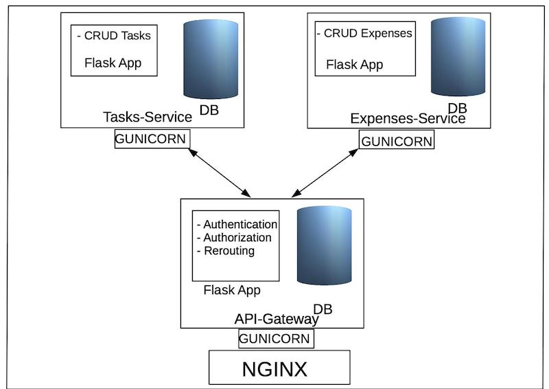

## Project Summary:

This project is a simple Todo/Expenses management App built using microservices (API Gateway) paradigm.

Each Microservice is a standalone Flask App with its own Persistence and Tests.

Everything is containerized and deployed using **Docker / docker-compose**.

Libraries used: **Flask**, **Flask-restful**, **Flask-SQLAlchemy**, **Marshmallow**, **Flask-JWT-Extended**

## Architecture:


## How to run:

- In order to run it simply run:   ```docker-compose up --build```

- Login using a POST request at: ```http://127.0.0.1:8000/auth/login``` { username: 'dev_user_1', password: 'passpass' }

- Browse following links:

| Action  | path | Method  |
|---------|------|---------|
| List Tasks  | /tasks  | GET  |
| Add Task  | /tasks | POST  |
| Get Task  | /tasks/<task_id>  | GET  |
| Edit Task  | /tasks/<task_id>  | PATCH  |
| Delete Task  | /tasks/<task_id>  | DELETE  |
| List Expenses  | /expenses  | GET  |
| Add Expense  | /expenses | POST  |
| Get Expense  | /expenses/<expense_id>  | GET  |
| Edit Expense  | /expenses/<expense_id>  | PATCH  |
| Delete Expense  | /expenses/<expense_id>  | DELETE  |
